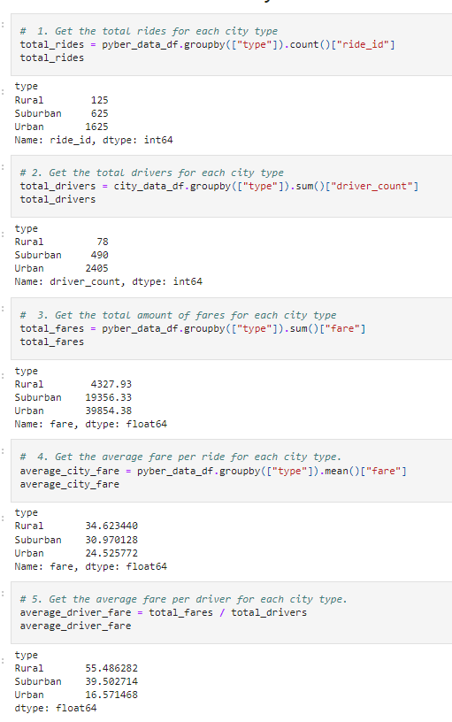
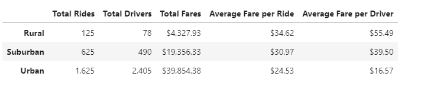

# PyBer_Analysis
Module  5 Challenge

## Overview of Project

CEO V.Isualize requested that I assist Omar in providing analysis on all ride-sharing data broken down by three city types; urban, suburban, and rural.  The analysis will contain information regarding total number of fares, total drivers, and total dollar amount of fares per city type.  Also, the analysis will contain the average per ride fare and the average fare per driver per city type. 

### Purpose

The metric and visualizations pulled from this analysis will be the primary source of information that will be utilized to identify any disparities in results across the multiple city types about financial performance of each city type.  This information will be used to provide recommendations to the CEO of PyBer, V. Isualize for improvements to address any disparity that may be encountered during this analysis.

## Results

Using Pandas and Matplotlib, Omar and I were able to create a summary table and a multiline graph by pulling data from two files provided, city_data.csv and ride_data.csv.  We were able to use these data sets and group the cities into three city types; urban, suburban, and rural.  Not only were we able to segregate the data into three city types but, were able to take the data for each city type and provide more granularity around the data by calculating the following:

* Total number of fares 
* Total drivers
* Total dollar amount of fares per city type
* Average per ride fare
* Average fare per driver per city type

### Code Used to Pull Required Data For PyBer Analysis

To pull data required to perform this analysis we merged two files, city_data and ride_data into a single data frame. Then we created multiple series by using code to pull specific data we would need to run calculations to be used for the data summary. 

*Creation of multiple Series code to be assembled inside of a data frame.

*Assembling of Series data into a data frame that will be used for data analysis.

*Formatting of dataframe data output.

### Analysis of PyBer Dataframe Summary

*Resulting table created from dataframe creation

Upon running the Analysis between data sets the following can be observed:

* There are 13 and 2.6 times more rides in Urban areas than rides in rural and suburban areas, respectively.
* However, there are 30 and 4.9 times more drivers in urban areas than in rural and suburban drivers, respectively.
* The data above also shows that the urban driver, on average, receives less fare per ride than rural and suburban drivers.  30% less when compared to rural and 20% less compared to suburban drivers.
* The average fare per driver is higher for rural drivers as well, $55.49 per driver when compared to $39.50 and $16.57 per suburban and urban drivers, respectively.

### Analysis of Line Graph Summary

*Line graph plot highlighting total fares on a weekly basis for the three city types, Urban, Suburban and Rural

At an initial glance, there are no real surprises when reviewing the line graph above. On an aggregate basis, one would expect the total fares to be higher for the urban and suburban areas than when compared to rural areas.  Relying solely on the line graph above could be quite deceptive. It appears that the urban areas out earn both suburban and rural areas combined. Which would make sense as the sheer demand for PyBer services in urban areas, when compared to rural areas, is much higher.  To get a more accurate depiction of the state of PyBer and its employees, any decisions being made should not rely on the line plot alone.

## Summary

Based on the analysis above, the primary take-aways are that although urban areas have 13 times more rides than rural areas, there are 30 times more drivers in urban areas competing for those rides than compared to rural areas.  This could be a factor in lower fares per rides in urban areas.  In addition to higher level of competition in urban areas for rides, an assumption can be made that distance traveled per ride (a factor that impacts fares) is further in rural areas than in urban areas on a per ride basis.  Below will be a summary of steps to improve overall company performance plus recommended additional analysis of data to provide better direction to the CEO V. Isualize.

CEO V. Isualize must decide on what is important to the company.  Will it be the overall revenue generated by the company regardless of the impact on the individual driver?  Or will the metric of fare per driver be one of the deciding factors that determines the company future.  If the CEO's primary concern is revenue and not margins, then finding ways to increase the number of drivers in each area may be the way to go.  Driving down fares may entice more riders to use PyBer services. Increase in riders may offset the drop in average fares and still increase revenue.  The unintended consequence could be driver churn.  Drivers could potentially leave PyBer if the money they earn is no longer worth the effort.

Another approach would be to find a balance between the benefit of the driver, the company, and the riders.  Based on the data summary table, we will look at the extreme differences between urban and rural areas. The average fare for rural areas is 3.3 times higher than urban areas, while the total drivers for rural areas are 30 times less than urban areas and rural rides are 13 times less urban rides.  How can PyBer level this disparity?  PyBer needs to find ways to increase average fares/ride in urban areas plus figure out ways to generate more total rides and drivers in rural areas. PyBer would have to do this while mitigating the effects of increased driver competition in urban areas and average fare erosion in rural areas that could occur if PyBer drivers in rural areas exceed the total rides increase.

### PyBer Urban Plan Proposal

PyBer could look to improve Urban data metrics by evaluating the following options:
* Advertise the benefits of using PyBer services for longer distance travel when compared to other alternatives
* Put a cap on quantity of drivers in urban areas to reduce competition
* Figure out other services that urban drivers could offer that would allow the driver to charge more per ride, i.e., WiFi hot spots, luxury service, et.

### PyBer Rural Plan Proposal

PyBer could look to improve Rural data metrics by evaluation the following options:
* Advertise the benefits of using PyBer services in rural settings
* Increase driver count by highlighting the flexibility and financial benefits of being a PyBer driver in rural areas.

### Further Analysis Proposal

To verify if the above proposals could lead to the intended benefits, I would propose additional analysis suggested below to have a better understanding of potential inflection points where riders will view other options as a better value when compared to PyBer's potential increase in fare/ride.  If PyBer's fares/ride could increase to a point where riders explore other options.  PyBer needs to find that point and stay just below it.

* Run analysis on transportation options that compete with Pyber.
  * Analysis on other ride share options to better understand earnings/ride, earnings/driver
  * Analysis on cost and convenience on public transit
  * Analysis on Taxi drivers earnings/ride, earning/driver
* Run analysis of potential unintended consequences of limiting quantity of PyBer drivers in urban areas
  * Will rates spike to high leading riders to other services hurting company revenue.
