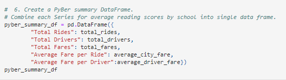
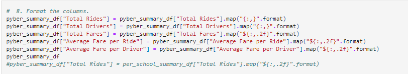
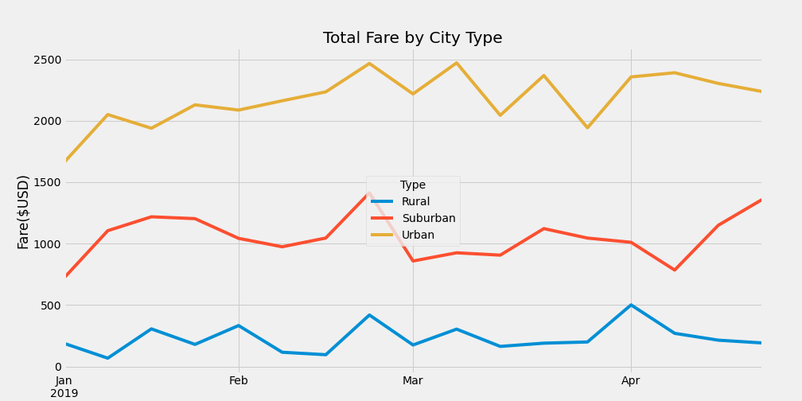

# Pyber_Analysis
Module  5 Challenge

## Overview of Project

CEO V.Isualize requested that I assist Omar in providing analysis on all ride-sharing data broken down by three city types, urban, suburban, and rural.  The analysis will contain information regarding total number of fares, total drivers, and total dollar amount of fares per city type.  Also, the analysis will contain the average per ride fare and the average fare per driver per city type. 

### Purpose

The metric and visualizations pulled from this analysis will be the primary source of information that will be utilized to identify any disparities in results across the multiple city types with regard to financial performance of each city type.  This information will be used to provide recommendations to the CEO of Pyber, V. Isualize for improvements to address any disparity that may be encountered during this analasys.

## Results

Using Pandas and Matplotlib Omar and I were able to create a summary table and a multiline graph by pulling data from two files provided, city_data.csv and ride_data.csv.  We were able to use these data sets and the cities into three city types, urban, suburban, and rural.  Not only were we able to segregate the data into three city types but, were able to take the data for each city type and provide more granularity around the data by calculating the following:

*total number of fares 
*total drivers
*total dollar amount of fares per city type
*average per ride fare
*average fare per driver per city type

### Code Used To Pull Required Data For PyBer Analysis

To pull data required to perform this analysis we merged two files, city_data and ride_data into a single data frame. Then we created multiple series by using code to pull specific data we would need to run calculations to be used for the data summary. 

*Creation of multiple Series code to be assembled inside of a data frame.

*Assembling of Series data into a data frame that will be used for data analysis.

*Formating of dataframe data output.

### Analysis of PyBer Dataframe Summary

*Resulting table created from dataframe creation

Upon running the Analysis Analysis between data sets the following can be observed:

* There are 13 and 2.6 times more rides in Urban areas than rides in Rural and Suburban areas, respectively.
* However, there are 30 and 4.9 times more drivers in Urban areas than Rural and Suburban drivers, respectively.
* The data above also shows that the Urban driver receives less per ride than Rural and Suburban drivers.  30% less when compared to Rural and 20% less compared to Suburban drivers.
* The Average fare per driver is higher for Rual drivers as well, $55.49 per driver when compared to $39.50 and $16.57 per Suburband and Urban drivers, respectively.

### Analysis of Line Graph Summary

When eliminating Thomas High School ninth grade math and reading scores, it has a big impact on Thomas High Schools % Overall Passing data point by dropping it to 65.1%.  This is understandable as the scores were removed but the calculations were done on the entire student body.  However, when the analysis was performed only taking into consideration Thomas High Schools 10th, 11th, and 12th grade students scores and the respective student population, the changes observed were minimal when compared to the entire district.  More specific information is provided below:
 
 * % Overall Passing for Thomas High School students, excluding 9th grade was 90.63% when compared to the 90.95% average when the analysis was run including the suspect 9th grade data. While the district's % Overall Passing score was 65.2%
 * % Passing Reading showed a decline of .29% for Thomas High School students when the suspect ninth grade scores were removed when compared to the original data set.  
 * Average Math Scores and % Pass Math each showed less than .1% decline for the 9th grade excluded data set compared to the original data set.
 * Average Reading Scores showed less than .1% improvement for the 9th grade excluded data set compared to the original data set.
 * Please see a scaled down school summary below

### Summary

After Assigning NaNs to the 9th grade population at Thomas High School the District Summary displayed the following changes
* The average math score dropped by .1% for the data set assigning Thomas High School ninth grade scores to NaN
* The average reading score remained unchanged when compared to the data set assinging Thomas High School ninth grade scores to NaN
* % Passing math dropped by .2% for the data set assigning Thomas High School ninth grade scores to NaN
* % Passing reading dropped by .1% for the data set assigning Thomas High School ninth grade scores to NaN
* The % Overall Passing dropped by .3% from 65.2% to 64.9% after assigning Thomas High School ninth grade scores to NaN
* Special note, analysis noted above was pulled from reports that was set to one significant digit.
 
Unfortunately, due to academic dishonesty, we do not have a complete data set to properly evaluate all students, at all grade levels, at all schools. Although the student population removed was only 461 of 39,170 students.  This removal of data could impact decisions about where resources should be distributed and potentially cause further harm to the school(s) that could ultimately be impacted.  I would have been interesting to see how the schools compared if data had not to be excluded or removed.
